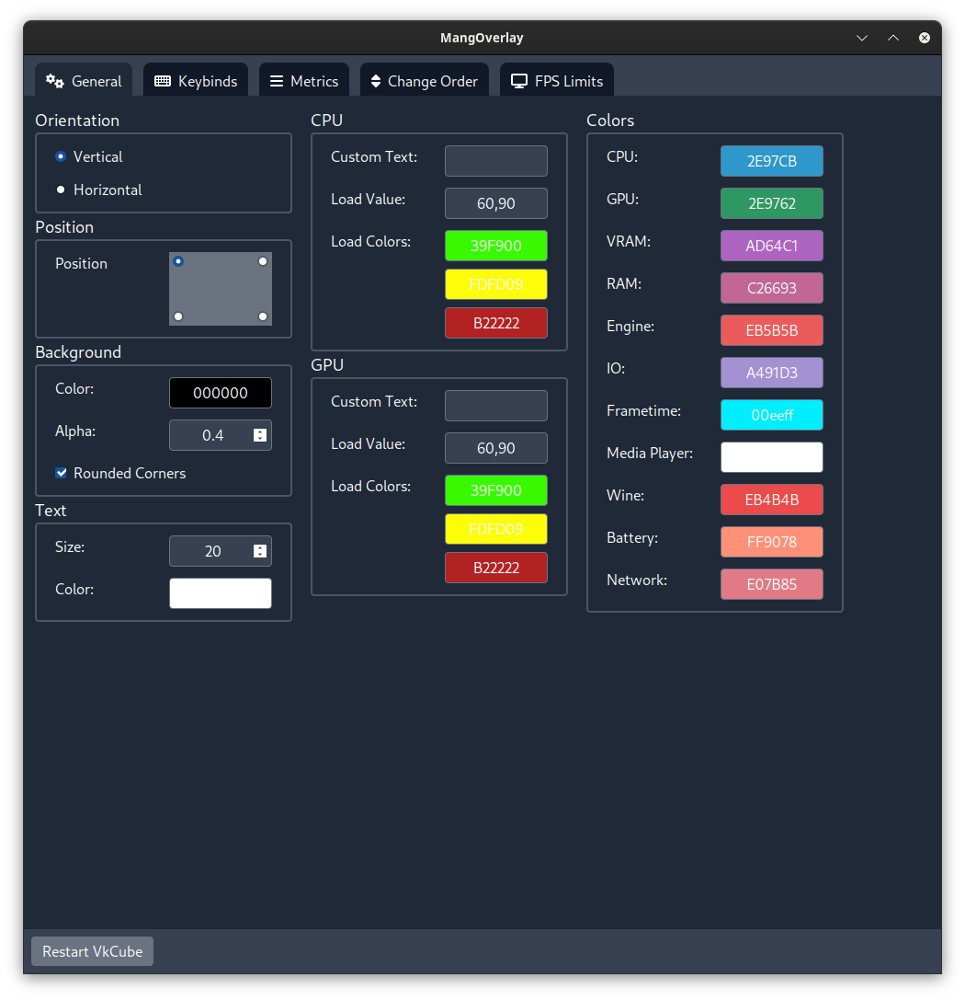
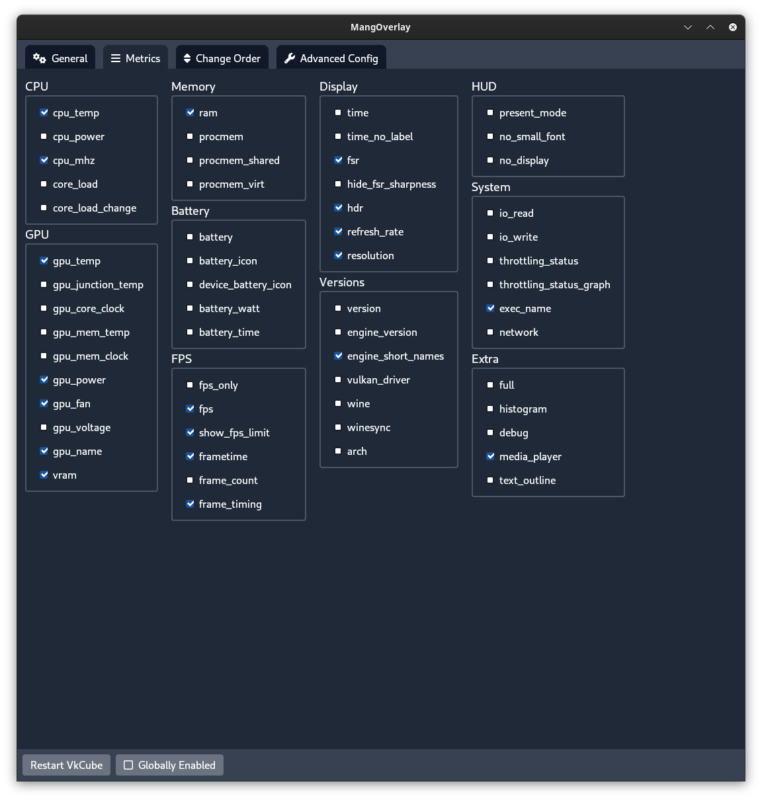
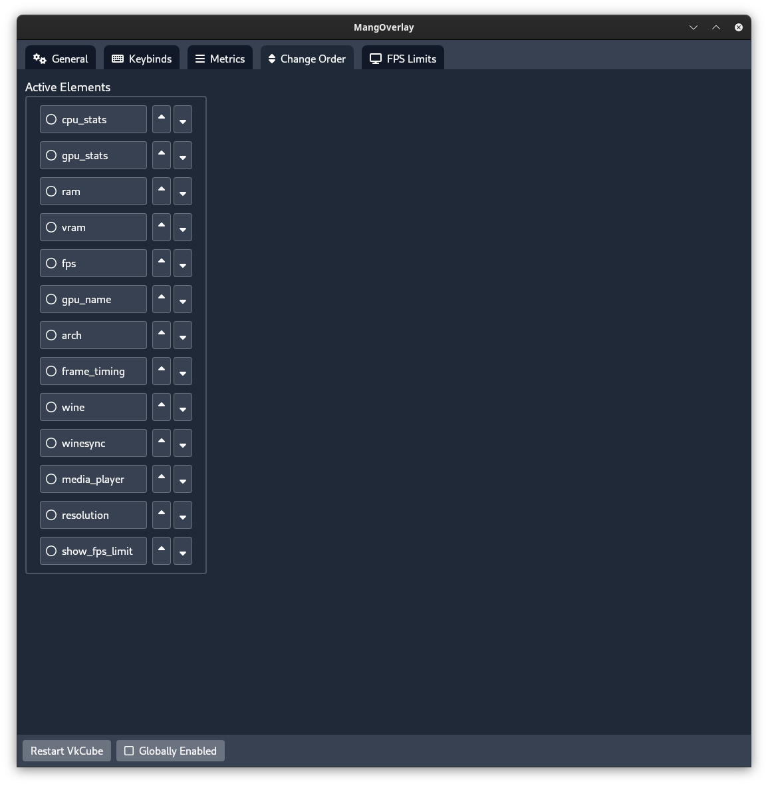
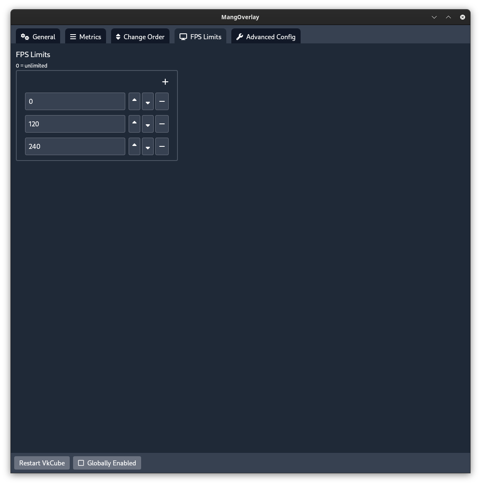
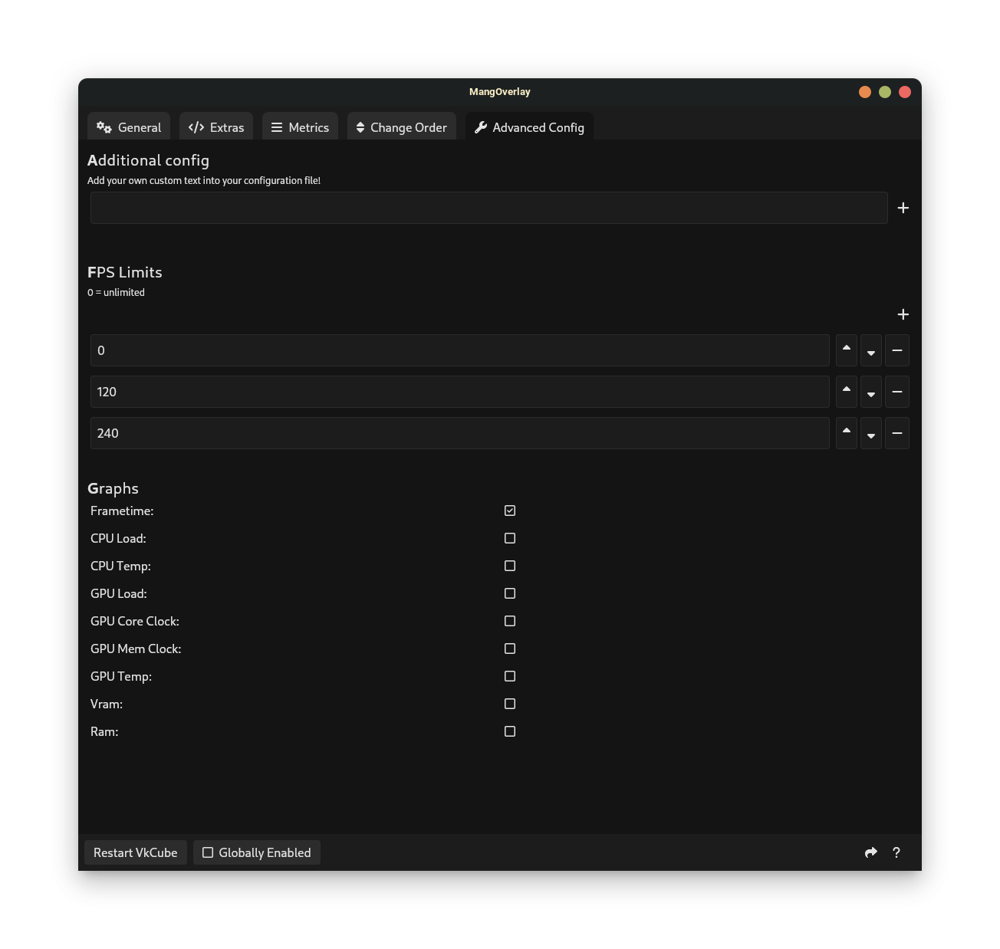

# MangOverlay

## About

MangOverlay is an open source GUI app for managing your MangoHud configuration. It aims to provide as much flexibility with it's settings as possible. 

## Building from source

This project was created using [wails.io](https://wails.io). Follow their [Getting started](https://wails.io/docs/gettingstarted/installation) guide to setup everything you need. 
Once everything is installed, check your dependencies with `wails doctor` and make sure you install all missing dependencies.
If everything's installed, you can build this project by running `wails build` inside the root directory. 

## Installation

You can find installation instructions on the [Releases](https://github.com/loissascha/MangOverlay/releases) page.

