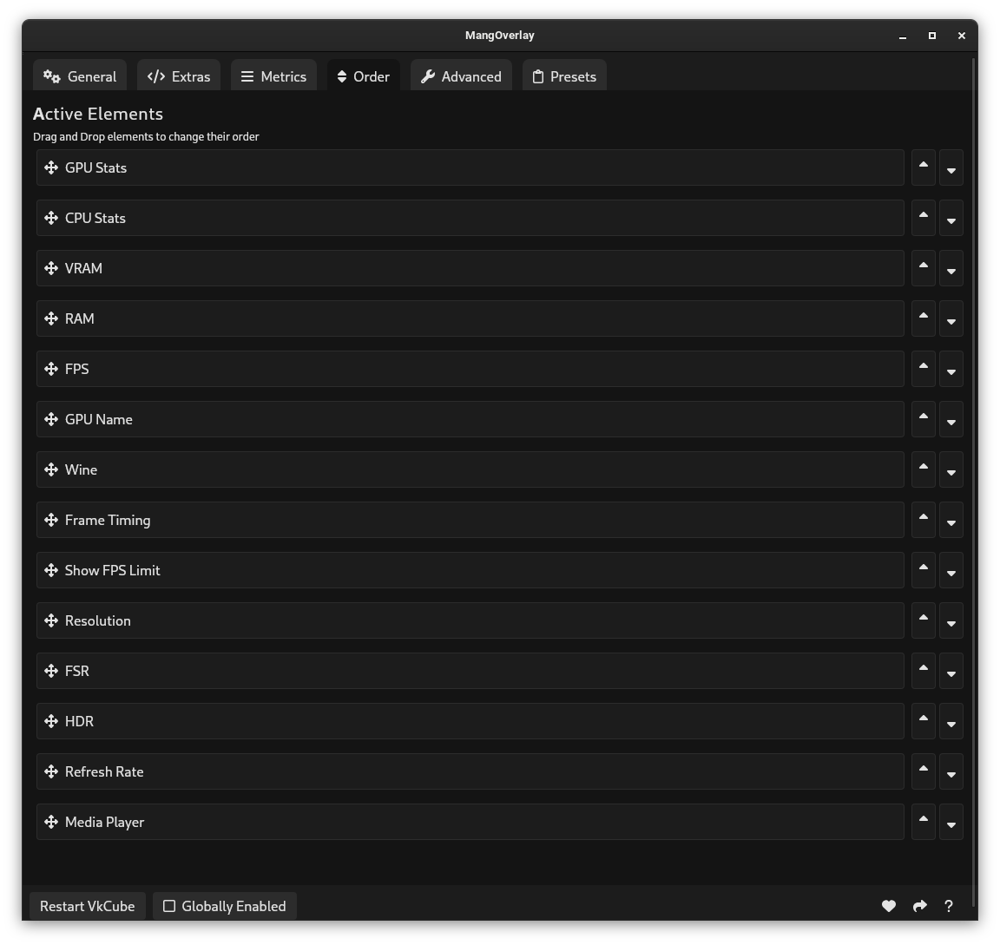

# MangOverlay

## About

MangOverlay is an open source GUI app for managing your MangoHud configuration. It aims to provide as much flexibility with it's settings as possible. 

## Installation

You can find installation instructions on the [Releases](https://github.com/loissascha/MangOverlay/releases) page.

