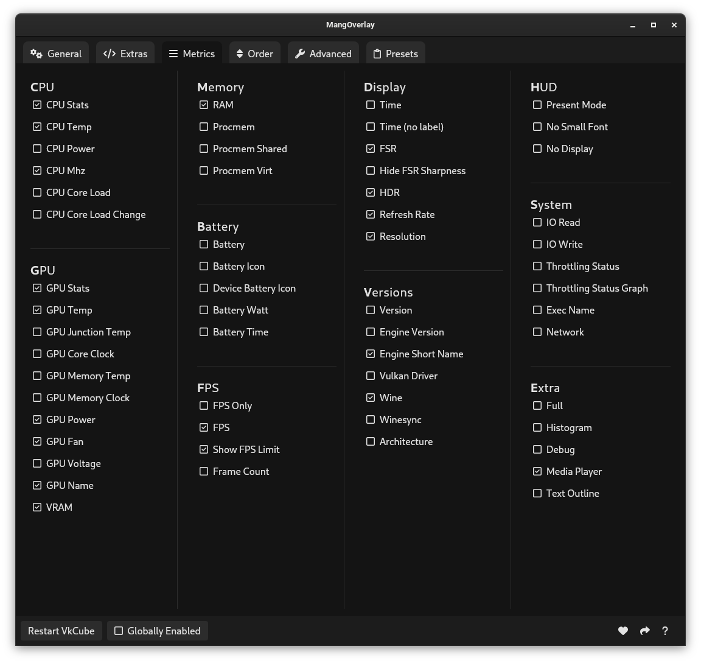
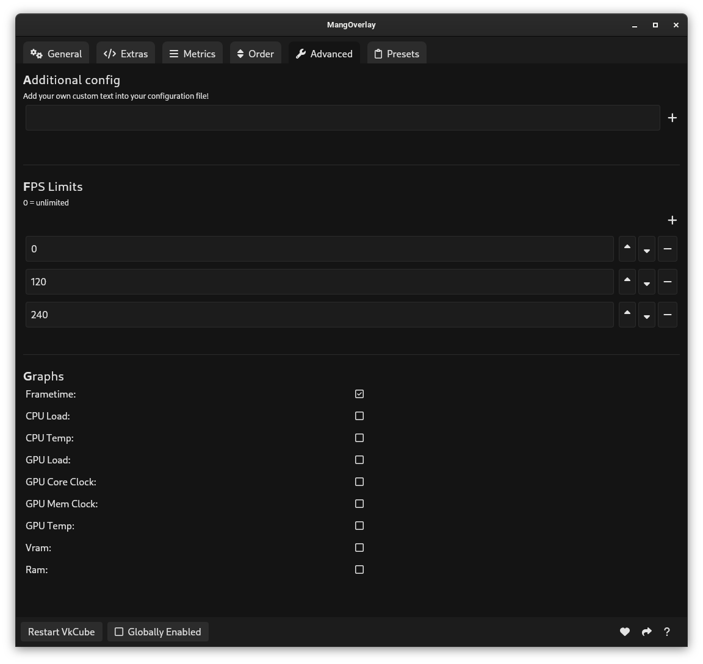

# MangOverlay

## About

MangOverlay is an open source GUI app for managing your [MangoHud](https://github.com/flightlessmango/MangoHud) configuration. It aims to provide as much flexibility within it's settings as possible.

## Installation

Available in the [AUR](https://aur.archlinux.org/packages/mangoverlay) or as [AppImage](https://github.com/loissascha/MangOverlay/releases/latest/download/MangOverlay.AppImage).

You can also find detailed installation instructions for other distributions on the [Releases](https://github.com/loissascha/MangOverlay/releases/latest) page.

## Building from source

This project was created using [wails.io](https://wails.io). Follow their [Getting started](https://wails.io/docs/gettingstarted/installation) guide to setup everything you need.
Once everything is installed, check your dependencies with `wails doctor` and make sure you install all missing dependencies.
If everything's installed, you can build this project by running `wails build` (or `wails build -tags webkit2_41` if you prefer building it for webkit2 41) inside the root directory. The finished build can be found inside the build/bin directory.
