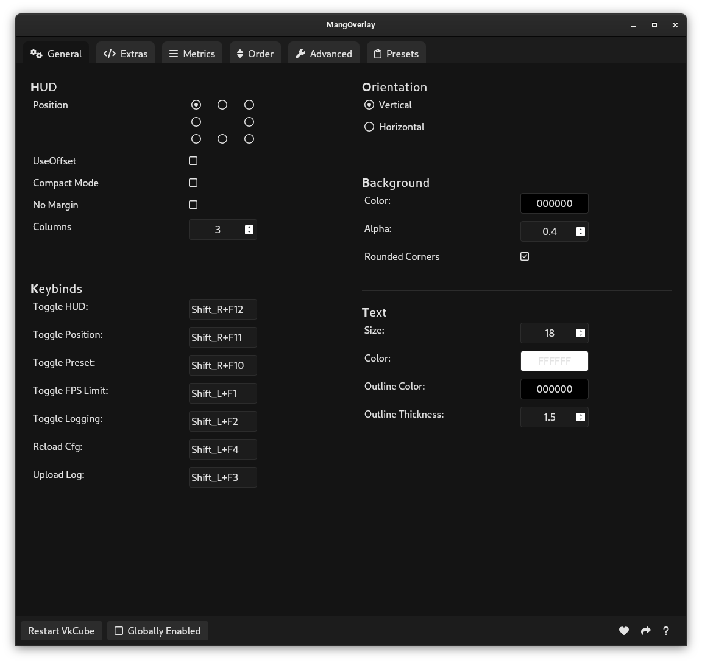

# MangOverlay

## About

MangOverlay is an open source GUI app for managing your MangoHud settings. It aims to provide as much flexibility with it's settings as possible. Currently only configures the system mangohud config file, in future I'd like to also add support for flatpak mangohud.

## Installation

You can find installation instructions on the [Releases](https://github.com/loissascha/MangOverlay/releases) page.

